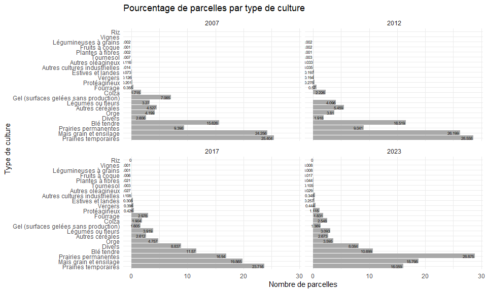

Analyse descriptive du mix cultural de la Bretagne (2007-2023)
================
Aziliz Joseph dit Pagny, Inès Bezie et Loïc Henry
2025-06-12

## Introduction

Ce document présente la répartition des cultures en Bretagne à partir
des données du **Registre Parcellaire Graphique** (RPG). Le RPG est une
base de données géographique qui recense les parcelles agricoles et les
cultures qui y sont pratiquées. Ces données sont déclarées par les
agriculteurs dans le cadre de leur déclaration de la Politique Agricole
Commune. Elles sont en [libre accès](https://geoservices.ign.fr/rpg) et
sont mises à jour chaque année.

L’objectif de cette analyse est de visualiser la diversité des cultures
pratiquées en Bretagne et d’identifier les principales cultures
présentes dans la région. En particulier, nous souhaitons identifier les
dynamiques des cultures (cultures émergentes ou en déclin) ainsi que
leur répartition spatiale. Cette analyse utilise les données du RPG sur
17 années (2007-2023), aggrégées à l’échelle de la commune. Les scripts
permettant de collecter, et préparer les données du RPG sont disponibles
sur GitHub dans le dépôts
[`RPG_PrepareData`](https://github.com/loichy/RPG_PrepareData) Nous
disposons ainsi de l’usage des sols entre 24 et 28 grands groupes de
culture. Nous mesurons la surface dédié à chaque groupe de culture par
commune et année, ainsi que le nombre de parcelles.

Dans une première partie, nous présentons l’usage des sols de manière
globale en Bretagne sur la période 2007-2023. Dans la deuxième section,
nous étudions la dynamique des usages des sols, en étudiant en
particulier l’expansion des cultures émergentes et le déclin des
cultures en perte de vitesse. Enfin, nous étudions la diversité des
cultures à l’échelle des communes et son évolution dans le temps.

## Le mix cultural en Bretagne: une présentation générale

### Evolution de la surface agricole en Bretagne

Le graphique ci-dessous montre l’évolution sur la période 2007-2023 de
la surface agricole totale en Bretagne ainsi que sa distribution entre
communes.

<!-- -->

Ce graphique montre que la surface agricole utilisée totale en Bretagne
reste relativement stable dans le temps (ligne rouge). De manière
générale, on observe une légère décroissance de la surface agricole
totale, qui a diminué de près de 4% entre 2013 et 2023.

La distribution de la surface agricole totale par commune montre
également une stabilité importante (graphiques en violon, et boite à
moustache associée). Près de 90% des communes en Bretagne ont une
surface agricole utilisée inférieures à 3000 ha, et la médiane de la
surface agricole utilisée des communes restent stable dans le temps
(environ 1 080 ha).

A noter qu’en agriculture on parle davantage en hectares qu’en mètres
carrés. \*1 hectare = 10 000 mètres carrés donc 30 000 000 mètres carrés
= 3000 hectares.

### La spécialisation des cultures en Bretagne

#### Surface agricole par culture

La tableau ci-dessous présente les surfaces agricoles utilisés par
culture en Bretagne sur la période 2007-2023. Il s’agit du total des
surfaces par culture sur toutes les parcelles, qui est calculé par année
et dont nous présentons ici la moyenne sur la période 2007-2023.

| Groupe de culture                     | Surface de la culture (ha) | Part (%) |
|:--------------------------------------|---------------------------:|---------:|
| Surface agricole totale               |                  1664111.3 |       NA |
| Maïs grain et ensilage                |                   447515.7 |     27.3 |
| Prairies temporaires                  |                   398230.1 |     24.2 |
| Blé tendre                            |                   296648.3 |     18.1 |
| Prairies permanentes                  |                   186632.3 |     11.4 |
| Orge                                  |                    86933.7 |      5.3 |
| Autres céréales                       |                    61235.5 |      3.7 |
| Légumes ou fleurs                     |                    52898.3 |      3.2 |
| Colza                                 |                    45495.1 |      2.8 |
| Fourrage                              |                    28985.2 |      1.8 |
| Divers                                |                    16037.6 |      1.0 |
| Protéagineux                          |                    12200.5 |      0.7 |
| Gel (surfaces gelées sans production) |                    12094.8 |      0.7 |
| Estives et landes                     |                     4046.0 |      0.2 |
| Autres cultures industrielles         |                     4026.9 |      0.2 |
| Vergers                               |                     2973.0 |      0.2 |
| Autres oléagineux                     |                     2883.0 |      0.2 |
| Tournesol                             |                     2769.1 |      0.2 |
| Plantes à fibres                      |                     1887.6 |      0.1 |
| Légumineuses à grains                 |                      313.5 |      0.0 |
| Fruits à coque                        |                      238.5 |      0.0 |
| Vignes                                |                       61.8 |      0.0 |
| Oliviers                              |                        2.8 |      0.0 |
| Riz                                   |                        1.9 |      0.0 |

Utilisation des sols agricoles par culture (moyenne sur la période
2007–2023)

*Note : Les surfaces sont exprimées en hectares (ha) ; les parts
correspondent à la proportion de chaque culture par rapport à la surface
agricole totale.*

La surface agricole totale est de 1.6641113^{6} ha. Notons que le
[recensement agricole de
2020](https://draaf.bretagne.agriculture.gouv.fr/agreste-etudes-no4-2021-recensement-agricole-2020-la-bretagne-perd-un-quart-de-a2611.html)
reporte une surface agricole totale de 1 624 200 ha, soit une surface
2.46 % plus petite.

La culture la plus répandue en Bretagne est **le maïs**, qui représente
27.3 % de la surface agricole totale. Le maïs est suivi par les
**prairies permanentes et temporaires**, qui représentent respectivement
24.2 % et 11.4 % de la surface agricole totale. **Le blé tendre, l’orge
et les autres céréales** complètent le tableau des principales cultures,
représentant respectivement 18.1 %, 5.3 % et 3.7 % de la surface
agricole totale.

#### Part de parcelles agricoles par culture

La figure ci-dessous représente le pourcentage de parcelles agricoles
par type de culture en Bretagne pour quatre années (2007, 2012, 2017 et
2023). Il s’agit du nombre de parcelles par culture divisé par le nombre
total de parcelles recensés par le RPG en Bretagne sur l’année.

<!-- -->

Nous remarquons que les cultures occupant la très grande majorité des
parcelles sur la période sont aussi celles qui dominent la surface
agricole totale. En effet, les **prairies permanentes et temporaires**
ainsi que le **maïs** représentent à eux seuls plus de 50 % des
parcelles agricoles en Bretagne. Le **blé tendre**, l’**orge** et les
**autres céréales** sont également des cultures très répandues,
représentant respectivement environ 10 % des parcelles agricoles. Le
blé, l’orge et les autres céréales complètent également ce tableau.

Cependant, des cultures moins visibles dans la surface agricole totale
paraissent comme plus présentent en pourcentage de parcelles. Il s’agit
de culture cultivée souvent sur des plus petites parcelles, telles que
les légumes ou fleurs, et les cultures divers. Si celles-ci représentent
respectivement 3.2% et 1% de la surface agricole totale, elles
représentent 3.9% et 8.9% des parcelles cultivées en Bretagne en 2017.

## Evolution dynamique du mix cultural en Bretagne

Cette section présente des analyses statistiques visant à identifier des
cultures en développement et en déclin en Bretagne. Etant donné le grand
nombre de catégorie de cultures différentes, et la très grande
domination de la surface agricole pour certaines de ces cultures la
comparaison directe de l’évolution des surfaces n’ait pas rendue facile.
Certaines cultures ont des surfaces très largement supérieur, par
exemple la culture de maïs est environ 1 000 fois plus importante en
surface que la culture des légumineuses.

Pour cette raison, nous avons choisi de présenter les évolutions
relatives des surfaces agricoles par culture. Dans un premier temps,
nous calculons alors le taux de croissance inter-annuel des surfaces
agricoles utilisés par la culture, de la manière suivante
$g_{kt} = \dfrac{y_{kt} - y_{kt-1}}{y_{kt-1}}$, où $g_{kt}$ est le taux
de croissance de la culture $k$ à l’année $t$, et $y_{kt}$ est la
surface agricole utilisée par la culture $k$ à l’année $t$. Cette
analyse permet de comprendre la variabilité entre année des surfaces
utilisés par la culture.

Dans un second temps, nous calculons la croissance de la surface associé
à la culture en base 100, où l’année de référence est celle associée à
l’entrée de la culture dans les données RPG. Ainsi, pour chaque culture,
nous calculons la surface agricole utilisée par la culture $k$ à l’année
$t$ divisé par la surface agricole utilisée par la culture $k$ à l’année
d’entrée dans les données RPG, que nous multiplions par 100. Cette
analyse permet de comprendre l’évolution des surfaces agricoles
utilisées par la culture depuis son entrée dans les données RPG, et de
comparer alors les croissances des surfaces entre culture.

### Analyse des taux de croissance inter-annuels des surfaces agricoles
